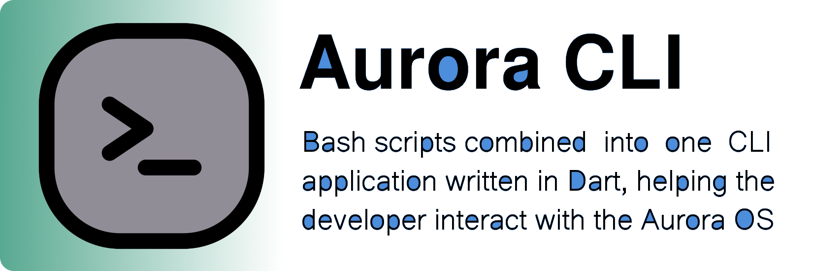

# Aurora CLI



[](https://snapcraft.io/aurora-cli)

An application that combines different scripts that help an Aurora OS programmer in his daily work. You can use separate scripts - each of them is an atomic unit. Or install a CLI application (available in snap) and use all the scripts if necessary with a convenient interface.

[](https://youtu.be/8PGj5qGYmcU)

## Install

[](https://snapcraft.io/aurora-cli)

```
sudo snap install aurora-cli --devmode
```

Additional dependencies to work Flutter

```
sudo apt update && sudo apt install curl git git-lfs unzip bzip2
```

## Build

You can build the Dart application with the following command from the root directory:

```shell
aurora_cli/scripts/build.sh
```

The second step is to build a snap package:

```shell
aurora_cli/scripts/snap.sh
```

You can run the application with arguments using the following command:

```shell
aurora_cli/scripts/run.sh --version
```

To run build scripts you must have [Snapcraft](https://snapcraft.io/docs/installing-snapcraft) & [Dart](https://dart.dev/get-dart) installed.

## Features

* psdk
  - installed - Get list installed versions Platform SDK.
  - available - Get list available versions Platform SDK.
  - install - Install Platform SDK.
  - remove - Remove Platform SDK.
  - validate - Validate RPM packages.
  - sign - Sign (with re-sign) packages.
* flutter
  - installed - Get list installed versions Flutter SDK.
  - available - Get list available versions Flutter SDK.
  - install - Install Flutter SDK.
  - remove - Remove Flutter SDK.
* embedder
  - installed - Get list installed versions Flutter Embedder.
  - available - Get list available versions Flutter Embedder.
  - install - Install Flutter Embedder.
  - remove - Remove Flutter Embedder.
* device
  - ssh-copy - Add ssh key to device.
  - command - Execute the command on the device.
  - upload - Upload file to Download directory device.
  - install - Install RPM package in device.
  - run - Run application in device in container.
  - index - Select index.
  - all - Select all devices.

### License

```
Copyright 2023 Vitaliy Zarubin

Licensed under the Apache License, Version 2.0 (the "License");
you may not use this file except in compliance with the License.
You may obtain a copy of the License at

    http://www.apache.org/licenses/LICENSE-2.0

Unless required by applicable law or agreed to in writing, software
distributed under the License is distributed on an "AS IS" BASIS,
WITHOUT WARRANTIES OR CONDITIONS OF ANY KIND, either express or implied.
See the License for the specific language governing permissions and
limitations under the License.
```
